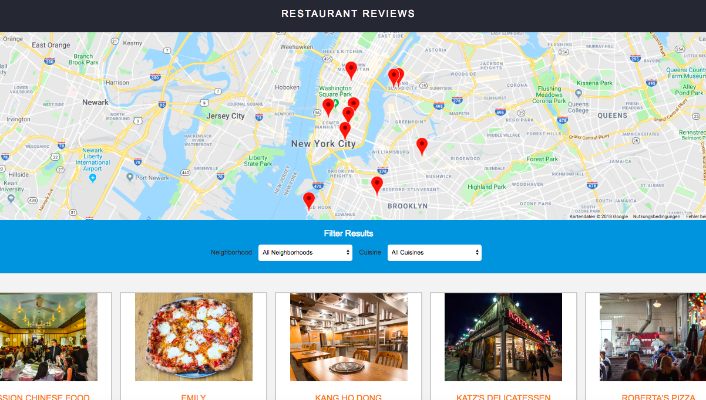

# Restaurant Reviews App

This is one of my projects for the Udacity Front End Nanodegree program and focusses on these topics:

1. Responsiveness
2. Accessibility
3. Offline first (service worker)

The app consists of a google map showing different restaurants and select fields for filtering these restaurants by location und cuisine. Restaurant infos and ratings are shown when clicking on the restaurant detail page.

## How to use this app

Download the whole folder from via `git clone: https://github.com/krempin/frontend-nanodegree-restaurant-app`. Use the command line and navigate to the folder `frontend-nanodegree-restaurant-app`. Now use Python to set up a HTTP server.

Check the version of Python you have: `python -V`. If you have Python 2.x, spin up the server with `python -m SimpleHTTPServer 8000` (or some other port, if port 8000 is already in use.) For Python 3.x, you can use `python3 -m http.server 8000`. If you don't have Python installed, navigate to Python's [website](https://www.python.org/) to download and install the software.

With your server running, visit the site: `http://localhost:8000`.

## API key

Please note that you need your own API key to run the Google Map. The key contained in this code will only work with specific IPs to prevent abuse.

